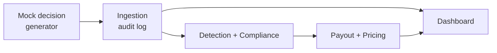

# AEGIS — AI Exposure Governance & Insurance Shield

*A governance-and-claims product for insurance carriers running agentic AI.*

Built as an academic/enterprise-style project positioned against
Guidewire's Qusar agentic AI framework.

---

## Problem statement

In August 2026, Guidewire launched **Qusar**, an agentic AI framework
built directly into PolicyCenter, ClaimCenter and BillingCenter. It lets
carriers deploy AI agents that make real underwriting and claims decisions
on their own — approve or deny a claim, price a policy, flag a submission
as fraud — inside the same install base Guidewire already runs across
**570+ carriers in 43 countries**.

This creates a liability surface no existing product covers. If one of
those agents makes a bad call at scale — a wrongful claim denial, biased
underwriting, a mispriced book of business — the carrier bears the full
loss: regulatory fines, bad-faith litigation, reversed claims, reputational
damage.

Today's AI-liability insurers (Corgi, Armilla, Mount, HSB/Munich Re, AIUC,
Klaimee) all insure companies that *build or use* AI generally. None of
them are purpose-built for a regulated core insurance system, where a
single agent decision is legally consequential in a way a chatbot's
mistake isn't, and where the rules differ by jurisdiction (EU AI Act, US
state insurance commissioners, India's IRDAI). That's the gap AEGIS fills.

## Proposed solution

**AEGIS** is governance plus insurance for a carrier's own AI agents. It
watches every agent decision, flags the risky ones, and pays out
automatically when a decision turns out to cause the carrier real loss.
Five moving parts:

1. **Watch** — every AI-agent decision is logged with its full reasoning
   trail as it happens.
2. **Check** — an anomaly/bias engine compares each decision against
   historical human-adjudicator patterns and flags outliers.
3. **Comply** — a rules engine maps the carrier's jurisdiction to what
   that region legally requires, so a flagged decision is checked against
   the right bar.
4. **Pay** — if a flagged decision leads to a reversed claim, a
   regulatory fine, or an SLA breach, payout to the carrier triggers
   automatically — parametric, no manual claims form.
5. **Price** — every decision and its outcome feeds back into
   underwriting, so a carrier's own agent-error rate sets its premium.
   Fewer mistakes, cheaper cover — a built-in incentive to run safer AI.

AEGIS is pitched as a monitoring-and-claims module that plugs into a
Qusar-style agentic deployment and a claims engine like ClaimCenter — it
doesn't replace that stack, it insures what it now lets carriers do.

## Why AEGIS is different

- **Different beneficiary.** Existing players insure the company that
  *owns* the AI. AEGIS insures the carrier against its *own* agent's
  mistakes specifically.
- **Event-driven claims, not filed claims.** Payout triggers off a
  logged decision plus an SLA/reversal condition — the same parametric
  mechanic used in flight-delay or crop insurance, applied to claims
  engines for the first time this way.
- **Regulation-aware by design.** A jurisdiction rules map (EU, US, India
  and beyond) is built in from day one, matching Guidewire's global
  footprint rather than being bolted on later.
- **Self-correcting economics.** Premium is a function of the carrier's
  own agent error rate — a real incentive to build safer AI, not just a
  policy that pays out after the fact.

## About Qusar, and how AEGIS relates to it

Qusar is Guidewire's agentic AI framework, announced in August 2026,
letting carriers run AI agents directly inside PolicyCenter, ClaimCenter
and BillingCenter to handle underwriting, claims and FNOL decisions
autonomously. It's a genuinely significant shift: for the first time,
decisions that used to require a human adjudicator can be made end-to-end
by an agent, at the scale of Guidewire's entire carrier base.

That shift is exactly what makes AEGIS necessary. Qusar gives carriers the
power to deploy agentic decision-making — it doesn't give them a way to
insure against that power going wrong. AEGIS is designed to sit
immediately downstream of a Qusar-style agent: every decision an agent
makes is exactly the kind of event AEGIS's ingestion layer is built to
receive, watch, and — when something goes wrong — act on.

**In this build**, we don't have access to a live Qusar sandbox or a
public integration API, so the ingestion layer uses a `MockDecisionGenerator`
that produces events in the same shape a real Qusar agent's decision log
would take (agent id, decision type, outcome, jurisdiction, reasoning
trail). The rest of the system — detection, compliance, payout, pricing —
is built against that shape, so the only thing that would need to change
with real sandbox access is the data source itself, not the product.

## Architecture

One Spring Boot application, one Maven module, three packages — each
package a clean, independently ownable slice of the pipeline below.



| Package | Owns | Depends on |
|---|---|---|
| `com.aegis.contracts` | Shared records: `DecisionEvent`, `FlaggedDecision`, `PayoutResult` | — |
| `com.aegis.ingestion` | Mock decision generator, audit log, `DecisionEvent` publishing | `contracts` |
| `com.aegis.detection` | Anomaly/bias flagging, jurisdiction compliance checks | `contracts` |
| `com.aegis.payout` | Parametric payout engine, pricing feedback, dashboard | `contracts` |

Each package's own `README.md` has its full scope, files owned, and a
ready-to-paste Claude kickoff prompt is in `docs/CLAUDE_PROMPTS.md`.

## Tech stack

| Layer | Choice |
|---|---|
| Language | Java 21 |
| Framework | Spring Boot 3 |
| Database | H2 (in-memory), swappable to Postgres later |
| Frontend | Thymeleaf (server-rendered), shared nav/footer fragments |
| Build | Maven |
| Inter-package messaging | Spring `ApplicationEvent` |

## Getting started

```bash
git clone <this repo's URL>
cd aegis
mvn spring-boot:run
```

Then open `http://localhost:8080`.

Working on one of the three slices? Read `CONTRIBUTING.md`, then your
package's own `README.md` under `src/main/java/com/aegis/<package>/`.

## Repository layout

```
aegis/
├── README.md                  ← you are here
├── CONTRIBUTING.md             ← branch workflow, how to avoid merge conflicts
├── pom.xml
├── docs/
│   └── CLAUDE_PROMPTS.md       ← copy-paste Claude kickoff prompt per person
└── src/
    ├── main/java/com/aegis/
    │   ├── AegisApplication.java
    │   ├── contracts/           ← shared records (team-owned)
    │   ├── ingestion/            ← Person A
    │   ├── detection/            ← Person B
    │   └── payout/                ← Person C
    ├── main/resources/
    │   ├── templates/            ← layout.html (shared) + one folder per person
    │   └── static/css/
    └── test/java/com/aegis/      ← mirrors the main packages
```

## Team

3-person team, one slice each — see `CONTRIBUTING.md` for the full
workflow and each package's `README.md` for scope.
